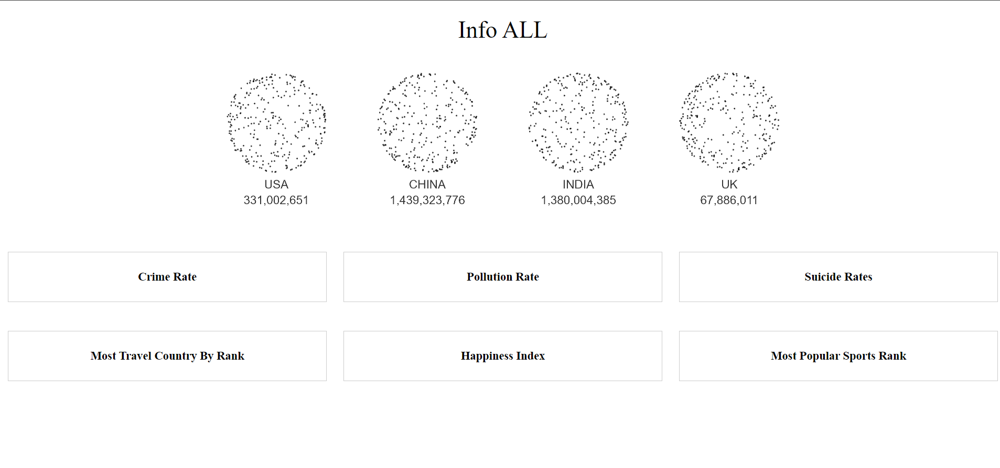
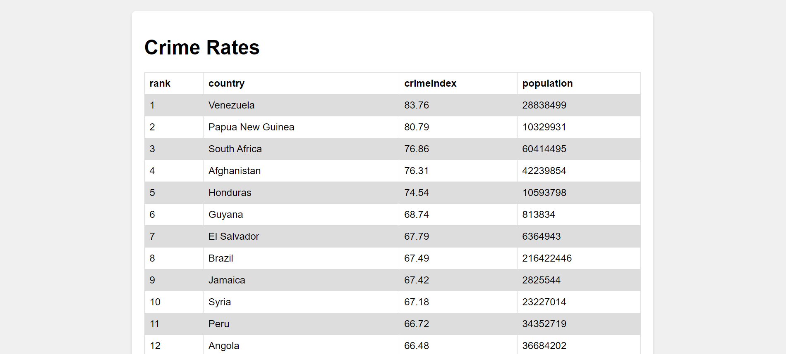
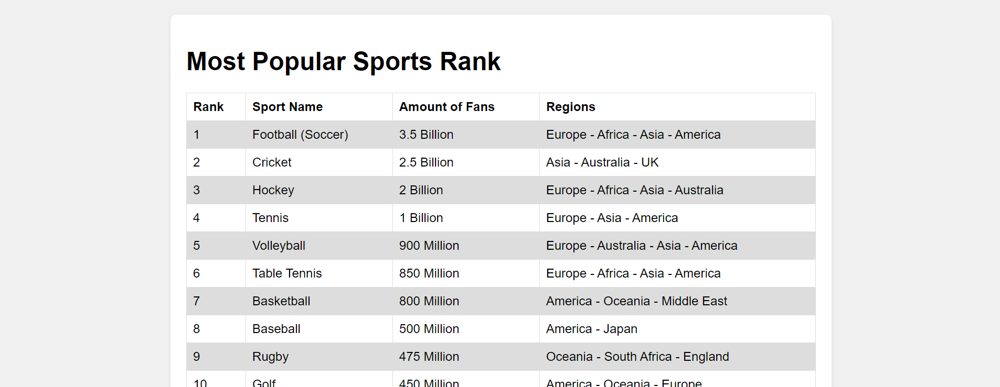

I developed 'Info ALL,' a centralized information platform designed to provide easy access to important global data on topics like crime rates, pollution levels, suicide rates, and more. The website is built using HTML, CSS, and JavaScript, focusing on responsive design to ensure accessibility across various devices.

For the front end, I employed HTML5 for the structure, using semantic elements to enhance accessibility and SEO. The styling is done through CSS, where I utilized Flexbox for layout organization and responsiveness. Interactive elements and dynamic data visualizations are implemented with JavaScript, particularly leveraging the GSAP library for animations and effects on the homepage. This creates an engaging user experience right from the first visit.

The site dynamically loads and presents data on individual topic pages, such as crime rates, using JavaScript to fetch information from CSV files. This approach allows for easy updates and management of the content without directly altering the site's code. Each topic page is designed with simplicity and user readability in mind, featuring data in a clean, table format.

Overall, 'Info ALL' aims to serve as a comprehensive resource for users seeking reliable and up-to-date information on critical global issues, packaged in an intuitive and visually appealing web experience.

https://github.com/jeetpatel31/Centralize-Website/assets/96985261/bb607031-8a90-4e02-83c0-b14170343df9

